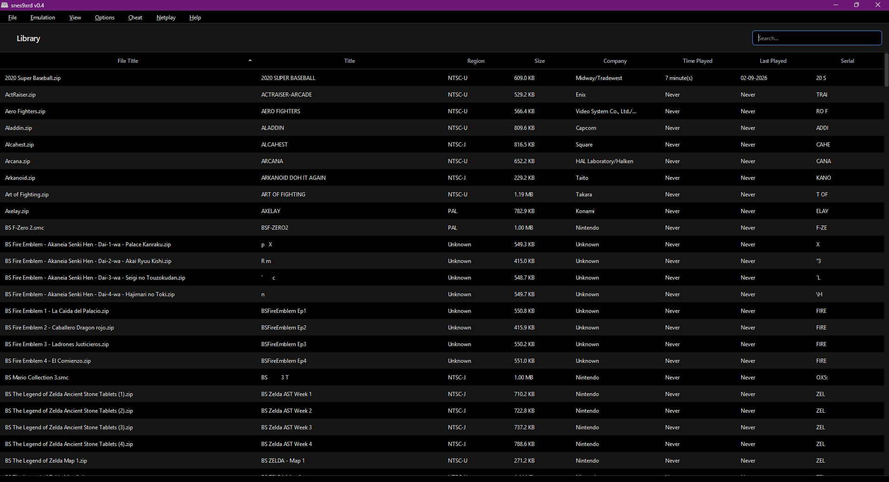
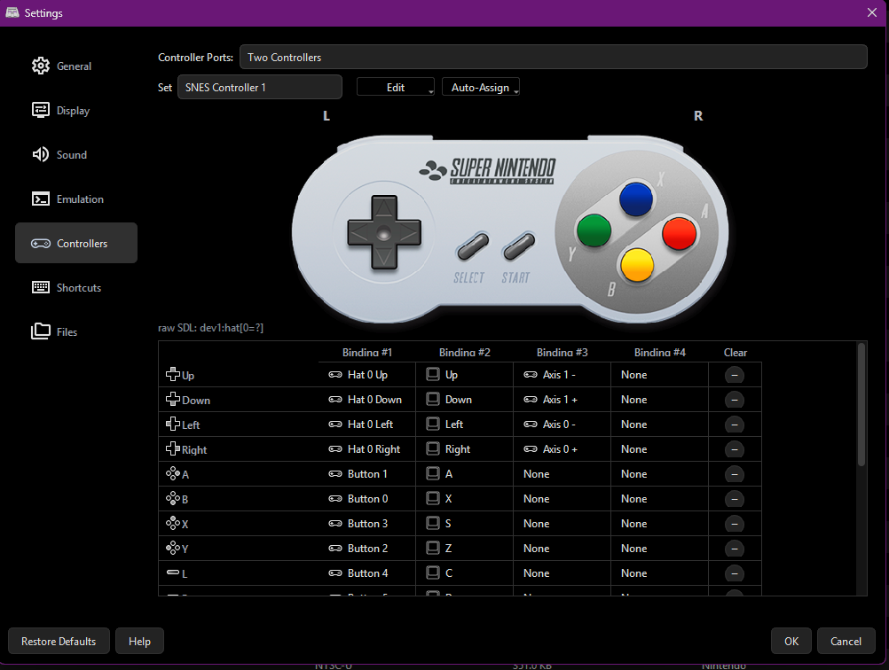
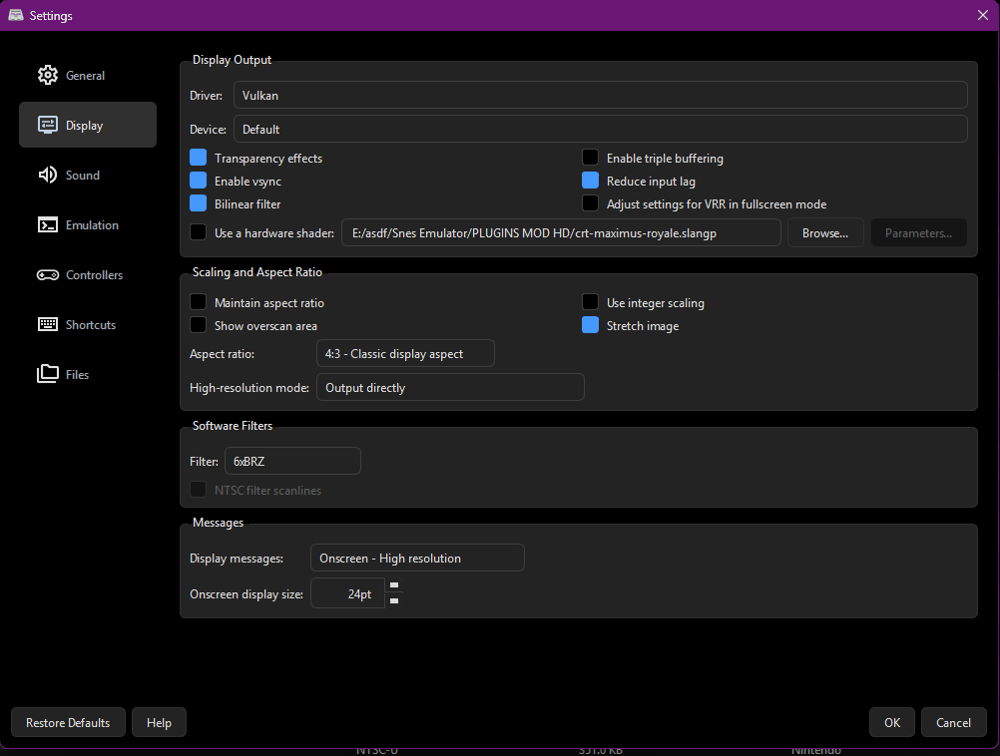
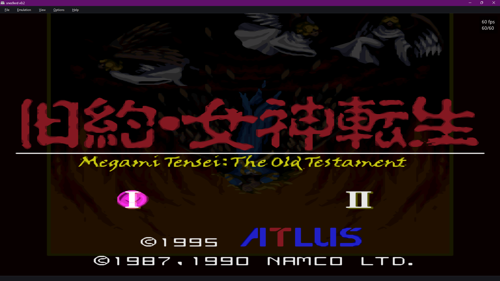
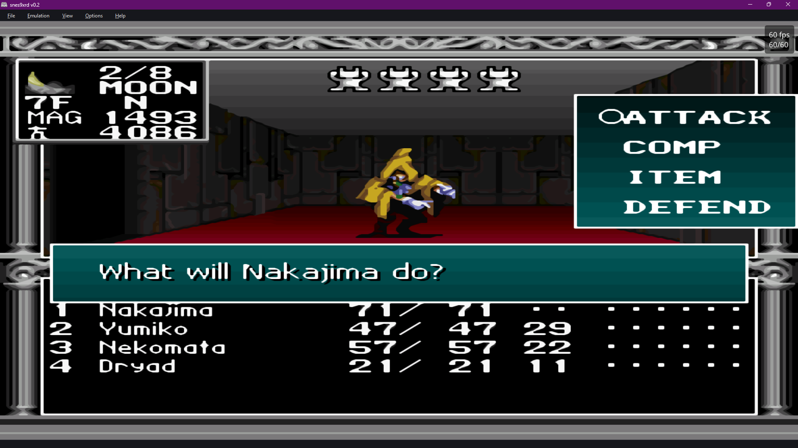
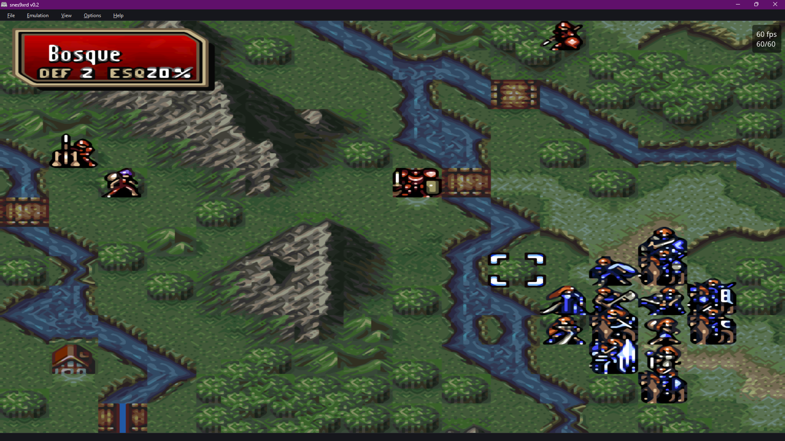

# snes9xrd
*Snes9x 1.63 — Portable Super Nintendo Entertainment System (TM) emulator, "sex edition" fork*

This is `snes9xrd`, a personal fork of [Snes9x](https://github.com/snes9xgit/snes9x) 1.63 maintained by DeAtSoUl56. It tracks upstream `master` closely — there's no separate branch for that — but rebuilds the Qt front-end and fixes bugs found along the way. Everything else (the emulation core, and the GTK/win32/macOS/libretro front-ends) is stock Snes9x.

See [docs/changes-snes9xrd.txt](docs/changes-snes9xrd.txt) for the full version-by-version changelog, and the [Releases page](../../releases) for prebuilt Windows binaries.

## Screenshots

| Game library | Controller bindings |
|:---:|:---:|
|  |  |

| Display settings | Gameplay |
|:---:|:---:|
|  |  |

| Gameplay | Gameplay |
|:---:|:---:|
|  |  |

## What's different from upstream

- **Qt front-end overhaul**: Display, Sound, Emulation and Controllers settings now have real parity with the legacy win32 dialogs (stretch/transparency/shader parameters, frame skipping, software filters, per-channel volume/mute, etc.).
- **Controller binding widget**: the on-screen SNES controller image now highlights exactly the button that's bound and pressed — no more pre-lit buttons or mismatched highlights — with a background that matches the settings theme.
- **Super Scope and Mouse bindings**: both light gun and mouse now have their own fully configurable binding table (Fire/Pause/Cursor/Aim Offscreen, Click L/R), including a genuine frame-synced **Auto Fire** turbo for Super Scope's Fire button.
- **Binding fixes**: axis/hat bindings are correctly disambiguated from each other and now survive a save/load round-trip; joystick button highlighting matches the same raw button index the bindings are captured from.
- **Simplified main window**: the sidebar added early in the fork's life was removed in favor of just the top menu bar; the Help → About dialog was restored with the fork's own credits.

For the full breakdown of the fork's layout, build systems, and conventions, see [AGENTS.md](AGENTS.md).

## Features

- **Save states**: 10 quick-save slots plus a separate "current slot" counter (Increase/Decrease Slot) that can go all the way to 999, and an **Undo State** shortcut that reverts the last Load State/Quick Load if it turns out to be a mistake.
- **Rewind**: hold the Rewind shortcut to play backwards through a rolling buffer, independent of save states.
- **Multiple input bindings**: every shortcut, controller button, and mouse/Super Scope action can have up to **4 simultaneous bindings** (Settings → Shortcuts/Controllers, the "Binding #1"–"Binding #4" columns), freely mixing keyboard keys, gamepad buttons/axes/hats, and mouse buttons.
- **Per-channel sound control**: each of the 8 SPC700 sound channels can be toggled independently, with a shortcut to turn them all back on at once.
- **Movie recording**: start/stop recording input movies, with frame-seek support during playback.
- **Cheats**: enable/disable the active cheat list, open the Cheats editor, or open the Cheat Search tool from a shortcut.
- **Speed control**: fast-forward (hold or toggle-lock), incremental speed up/down, frame skip up/down, and single-frame advance.

## Default Keyboard Shortcuts

All of these are rebindable (and clearable) from Settings → Shortcuts, unless noted otherwise. Entries marked *(fixed default only)* have a working default key but aren't yet exposed as a row in that dialog.

### General
| Action | Default key |
|---|---|
| Open ROM | `Ctrl+O` |
| Pause/Continue | `P` |
| Reset | `Ctrl+R` |
| Power Cycle Console | *(unbound)* |
| Quit | `Ctrl+Q` |
| Toggle Fullscreen | `F11` |
| Save Screenshot | `F12` |
| Save SPC | *(unbound)* |

### Save states
| Action | Default key |
|---|---|
| Save State to Current Slot | `Ctrl+S` |
| Load State from Current Slot | `Ctrl+L` |
| Undo State | `Ctrl+U` |
| Increase Current Save Slot | `Ctrl++` |
| Decrease Current Save Slot | `Ctrl+-` |
| Quick Save Slot 0–9 | `Shift+F1`–`Shift+F10` |
| Quick Load Slot 0–9 | `F1`–`F10` |

### Speed & playback
| Action | Default key |
|---|---|
| Enable Fast-Forward (hold) | `Tab` |
| Toggle Fast-Forward (lock) | `` ` `` |
| Rewind (hold) | `Y` |
| Speed Up *(fixed default only)* | `=` |
| Speed Down *(fixed default only)* | `-` |
| Increase Frame Skip *(fixed default only)* | `Shift+=` |
| Decrease Frame Skip *(fixed default only)* | `Shift+-` |
| Frame Advance *(fixed default only)* | `\` |

### Video
| Action | Default key |
|---|---|
| Toggle BG Layer 0–3 | *(unbound)* |
| Toggle Sprites | *(unbound)* |
| Change Backdrop Color | *(unbound)* |

### Sound
| Action | Default key |
|---|---|
| Toggle Sound Channel 1–8 | `Alt+1`–`Alt+8` |
| Toggle All Sound Channels | `Alt+0` |
| Mute Audio *(fixed default only)* | *(unbound)* |

### Movies
| Action | Default key |
|---|---|
| Start Recording | `Ctrl+Alt+R` |
| Stop Recording | `Ctrl+Alt+P` |
| Seek to Frame | *(unbound)* |

### Cheats
| Action | Default key |
|---|---|
| Toggle Cheats *(fixed default only)* | *(unbound)* |
| Cheats Editor *(fixed default only)* | `Alt+G` |
| Cheat Search *(fixed default only)* | `Alt+A` |

### Input devices
| Action | Default key |
|---|---|
| Grab Mouse | `Ctrl+G` |
| Swap Controllers 1 and 2 | `6` |

## Building

`git submodule update --init --recursive` is required before building anything (see [AGENTS.md](AGENTS.md#submodules) for the exact list of submodules).

### Qt (recommended for this fork)
```
cmake -G Ninja -B build -S qt -DCMAKE_BUILD_TYPE=Release
ninja -C build
```
On Windows, build from an MSYS2 CLANG64 shell. Qt6 and SDL3 are fetched automatically via CMake if not found on the system.

### Other front-ends (unix/X11, GTK, win32, macOS, libretro)
These are unmodified from upstream Snes9x — see [AGENTS.md](AGENTS.md#build-commands) for the build command for each.

## Upstream project

Please check the [Snes9x Wiki](https://github.com/snes9xgit/snes9x/wiki) for general information about the emulator, and the [upstream repository](https://github.com/snes9xgit/snes9x) for nightly builds and CI status of the base project this fork tracks.
